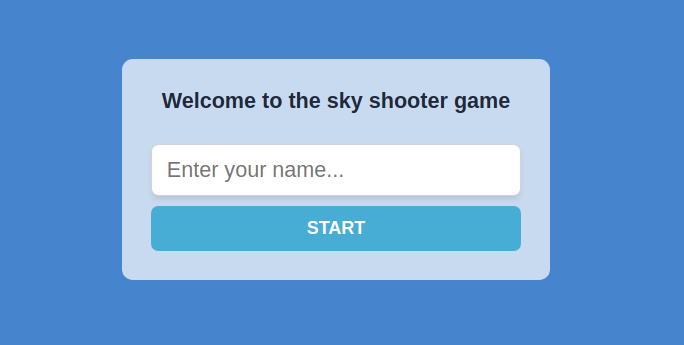

# Shooter_game

This project was about creating a shooter game using phaser library, the game
have enemy and a player and each one of them has the ability to shoot when the player shoot enemy will get scores in the dashboard.

### Register


### Play


### Get scores


## Getting Started

* Clone this repo
    ```
    git clone git@github.com:DeliceLydia/Shooter_game.git
    ```
* Navigate to Shooter_game folder
    ```
    cd Shooter_game
    ```
* On the terminal, while in the 'Shooter_game' directory:

* Run ``` git checkout feature-branch ```

* Run ``` git pull origin feature-branch ```

* Run ``` yarn install ``` to install dependencies

* Start the server by running ``` yarn run dev ```
   
* The server would usually start on port:3000

* Enjoy the game

## How to play

- After running your server you will be asked to provide your username
- When you click start it will take you to the game world where adventure start from
- Click play button you will be able to play
- Enemies will shoot you so to shoot you will press space key of your keyboard
- To move up you will press W key
- To move down you will press S key
- To move left you will press A key
- To move right you will press D key
- As a player when you shoot enemy you will be scored as the game will be over

## How to run tests

- Yarn test

## Built with

- HTML
- CSS
- Phaser
- Javascript

## Test with

- Jest

## Author

👤 **Delice Lydia**
  - GitHub: [Delice Lydia](https://github.com/DeliceLydia)
  - Twitter: [Delice](https://twitter.com/IngabireLydia3)
  - LinkedIn: [Delice Lydia](https://www.linkedin.com/in/delice-lydia/)

## Contribution

- Clone the repo using the above instructions
- Create a new branch: `git checkout -b awesome branch`
- Add your changes and commit the file
- Push to your forked repo
- Make a pull request to `develop` branch

## Acknowledgments

Credits goes to [York computer solutions LLC](https://learn.yorkcs.com/category/tutorials/gamedev/phaser-3/build-a-space-shooter-with-phaser-3/) for the space shooter game it helped me to design mine

## Show your support

Give a ⭐️ if you like 

## License

This project is [MIT](https://github.com/DeliceLydia/Shooter_game/blob/master/LICENSE) licensed

